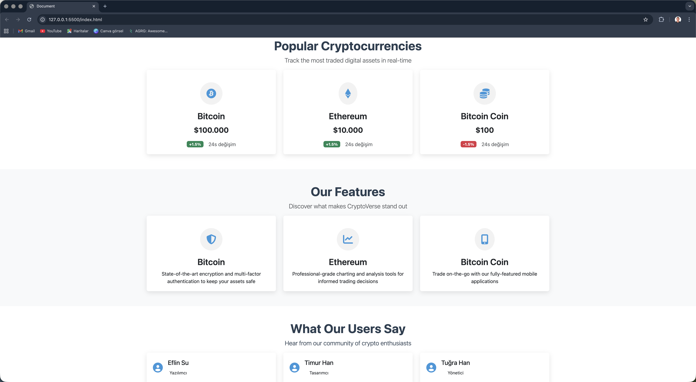
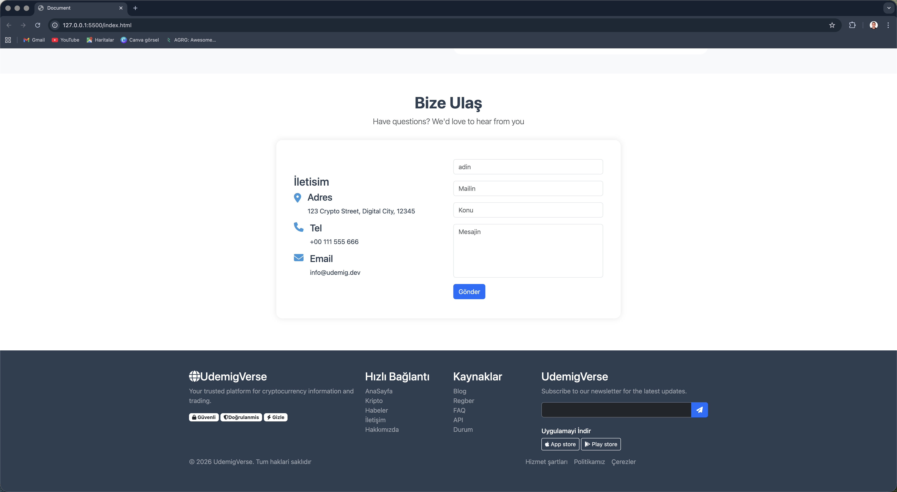

# 🚀 Crypto Web – Modern Cryptocurrency Landing Page 💎

### ✨ Professional, Responsive & Portfolio-Ready Frontend Project

---

## 📌 Overview 🧠

Crypto Web is a modern cryptocurrency landing page built with **pure HTML & CSS**.  
The goal of this project is to demonstrate **clean structure**, **strong visual hierarchy**, and **responsive layout discipline** in a real-world styled crypto interface. ✅

🎯 **Focus areas:**
- Clean & semantic HTML structure 🧱  
- Scalable CSS organization 🎨  
- Modern layout using Flexbox 🧩  
- Mobile-first responsive design 📱  
- Portfolio-ready documentation & presentation ⭐

---

## 🎥 Demo Preview 🎬

A quick look at the full UI flow and layout behavior:

---

## 🖼️ Screenshots Gallery 🧾

Below are key sections of the interface (with short notes to keep the page easy to scan 👀):

### 🏠 Hero & Landing Section
Big visual identity + clear call-to-action structure.

---

### 📊 Market / Feature Section
Feature blocks with clean hierarchy and readability-focused spacing.

---

### 🧰 Services & Information Blocks
Modular content structure with consistent layout rules.

---

### 📱 Responsive Layout Example
Responsive behavior across screen sizes using flexible layout principles.

---

### 🔍 UI Detail View
Typography, spacing, and visual consistency details.

---

### 🖥️ Full Page Overview (Full Screenshot)
Complete page view from top to footer (overall structure in one frame).

---

## 🛠️ Technologies & Tools 🧑‍💻

### ✅ Core Technologies
- 🧱 **HTML5** – semantic, structured markup  
- 🎨 **CSS3** – layout, styling, visual hierarchy  
- 🧩 **Flexbox** – modern layout system  
- 📱 **Responsive Design** – mobile-first approach  

### 🔧 Development Tools
- 🌿 **Git** – version control  
- 🐙 **GitHub** – repository management  
- 🧠 **VS Code** – development environment  

---

## 📂 Project Structure 📁---

## 🎯 What I Practiced / Improved 🚀

✅ Building clean HTML structure  
✅ Creating consistent CSS layout rules  
✅ Improving spacing & typography hierarchy  
✅ Designing sections like real product landing pages  
✅ Preparing a professional GitHub README presentation  

---

## 🙏 Special Thanks & Acknowledgments 🌟

This project was developed during my frontend training journey at ** @udemig ** 🎓  
A big thank you to the instructors and the learning system that supports real-world project development.

👨‍🏫 ** @isveckrali ** – special thanks for mentorship, guidance, and structured support throughout the learning process.  
Your teaching approach helped me build not only UI skills but also professional discipline. 💪✨

---

## 📞 Contact & Connect 🤝

---

crypto-web/
├── index.html
├── style.css
├── README.md
├── images/
└── screen/
├── demo.video.gif
├── screen1.png
├── screen2.png
├── screen3.png
├── screen4.png
├── screen5.png
└── fullscreen.png

---

⭐ If you found this project helpful, please consider giving it a **star**!  
Made with ❤️ by **Numan Balık** 🇸🇪

